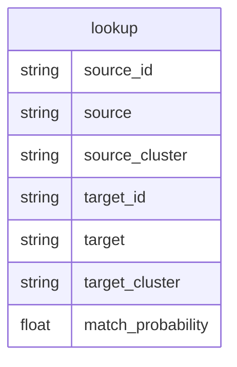

# 🔗 Company matching

A [Splink](https://moj-analytical-services.github.io/splink/) model for matching companies across DBT datasets.

See [Robin Linacre's series of articles on probabilistic record linkage](https://www.robinlinacre.com/probabilistic_linkage/) for theoretical underpinning (Fellegi and Sunter, 1969).

## Coverage

* [Companies House](https://data.trade.gov.uk/datasets/a777d199-53a4-4d0a-bbbb-1559a86f8c4c#companies-house-company-data)
* [Data Hub companies](https://data.trade.gov.uk/datasets/32918f3e-a727-42e6-8359-9efc61c93aa4#data-hub-companies-master)
* [Export Wins](https://data.trade.gov.uk/datasets/0738396f-d1fd-46f1-a53f-5d8641d032af#export-wins-master-datasets)
* [HMRC UK exporters](https://data.trade.gov.uk/datasets/76fb2db3-ab32-4af8-ae87-d41d36b31265#uk-exporters)

## Quickstart

* Create a `.env` with your development schema to write tables into. Copy the sample with `cp .env.sample .env` then fill it in
    * `SCHEMA` is where any tables the service creates will be written by default
    * `STAR_TABLE` is where fact and dimension tables will be recorded and checked
    * `PROBABILITIES_TABLE` is where match probabilities will be recorded and checked
    * `CLUSTERS_TABLE` is where company entities will be recorded and checked
    * `VALIDATE_TABLE` is where user validation outputs will be recorded and checked

## Notes

See [🔗Company matching v2.1 architecture ideas](https://uktrade.atlassian.net/wiki/spaces/DT/pages/3589275785/Company+matching+v2.1+architecture+ideas) for the architecture we're implementing here, codename 🔌hybrid additive.

### Structure notes

* `src/data/` contains classes for read/writing from our key tables
    * STAR (dim/fact lookup)
    * Dataset (dim/fact combos)
    * Probabilities (probability table)
    * Clusters (cluster table)
    * Validation (user validation table)
* `src/link/` contains an abstract Linker class and individual linker method subclasses
* `src/pipeline/` will contain matches that link the cluster table on the left with a dim table on the right, one script per link
* `src/config.py` configures the whole thing
* Not sure where entrypoint for a run is quite yet

### Process notes and ideas

* Some kind of `make setup` that sets up the system ready to link. Includes:
    * `make star`, which writes/updates a `star` table where each row is the name of a fact table and dimension table, plus a pk
    * `make dims`, which writes/updates the dim tables that are controlled by the framework
* `make links`, which uses `src/config.py` to run the whole pipeline step by step. Includes:
    * Instantiating the initial `clusters` table
    * Instantiate the `probabilities` table
    * For each link in the chain
        * Link cluster with table on right
        * Update `probabilities` with output
        * Update `clusters` with processed `probabilities`
        * Log performance vs `validate`
* A function to turn `clusters` into a `lookup` for the end user
* A streamlit app to validate connections found in either `clusters` or `probabilities`
    * A `validate` table that records user decisions
    * A reporting page that shows various model performance against this
        
### Linker notes

What does ANY linker neeed?

* The left data: cluster data, pivoted wide, with fields to join
    * Call cluster data method from Clusters
* The right data: dim table data
    * Call dim retrieval method from Dataset
* A prepare method. An optional bit for subclasses to fill in
    * Should require dict parameterisation
    * Preprocessing handled here, even if called from new methods
    * Linker training handled here, even if called from new methods
* A link method to output data. A bit subclasses MUST fill in
    * Optional experiment parameter
    * Ouput as df or direct to probabilities table?
        * Add experiment to Probabilities table so we can compare outputs
* An evaluate method
    * With option to use MLFlow
    * With option to output to Probabilities table
    * Against a single experiment ID (MLflow or otherwise)
        * Runs prepare
        * Runs link
        * Runs a standard report

What does ONE linker need?

* The above, but
    * link method must contain more code
    * prepare method might contain more code


## Output

### v0.1

The current output is:



### v0.2

I think we can do better. The proposed output below is a small relational database optimised for three separate use cases: **linking**, **deduping** and **verifying**.

[Notes on this on Confluence.](https://uktrade.atlassian.net/wiki/spaces/DT/pages/3573448705/Company+matching%3A+operationalisation)


* String storage is minimised with key relationships
* We use our knowledge of how fact tables relate to form a DAG of matching, where we only match between pairs of tables with an edge
* Calculation is saved by only matching on naïve-deduped records, which form dimension tables for each fact table of interest
    * Naïve deduping considers a combination of fields to be "unique" without any alteration. To improve naïve deduping, we need a ⚙️process that uses the below deduping outputs
    
I got carried away with the SQL translation from `lookup` and `verify` to `clusters`. Sorry. To explain it in English:

* The lookup table contains all pairwise predictions over a certaion %ge probability
* We join in `verify` when the `verified` bool agrees over a certain %ge, and allocate a probability match of 1
* We order these matches by %ge probability descending
* We take the highest probability match for each distinct pair of source id and target table and add it to `clusters`
    * This is achieved by recursing on an anti-join with `clusters` until lookup is empty
    * If a source id and target table is in `clusters`, it can't be inserted again
    * Recall a verified match is probability 1, always, so goes to the top
* This isn't in the SQL, but if all matches in the cluster are verified, `verified` is set to true in `clusters`
    
#### Linking

To **link** in production, we use something like this to return the relevant columns from the various fact tables, with lots of nulls:

```
select
    cl.uuid,
    f1.field_of_interest,
    f1.field_of_interest,
    f2.field_of_interest
from
    clusters cl
-- for each fact table we want to get data from
where
    source in (fact_table_1, fact_table_2, ...)
left join
    dim_table_1 d1 on
    cl.source_id = d1.unique_id
left join
    fact_table_1 f1 on
    -- repeat for all fields except unique_id
    d1.unique_field_* = f1.unique_field_*
```

It's up to the user and use case as what to do next.

* To summarise something like HMRC exporters, add `group by cl.uuid` and use `max()` for fields you're certain have a single value (like the name in Data Hub), and `avg()`, `sum()`, `count()` or whatever to get your summary stats
* To get unique values on a single row, add `group by cl.uuid` and use `max()` to drop all the nulls

Ideally we'd fold this into a `company_join()` PostgreSQL function to hide the mess.

#### Deduping

To **dedupe** in production, we use something like this to show a list of pairs of potential duplicates in a single table:

```
select
    lk.source_id,
    lk.match_probability,
    fl.field_of_interest,
    fr.field_of_interest,
from
    lookup lk
where
    source = target
    and source = 'fact_table'
left join
    dim_table dl on
    lk.source_id = dl.unique_id
left join
    fact_table fl on
    -- repeat for all fields except unique_id
    dl.unique_field_* = fl.unique_field_*
left join
    dim_table dr on
    lk.source_id = dr.unique_id
left join
    fact_table fr on
    -- repeat for all fields except unique_id
    dr.unique_field_* = fr.unique_field_*
```

Ideally we'd fold this into a `company_dedupe()` PostgreSQL function to hide the mess.

#### Verifying

To **verify** in producion, we provide a bool in the `clusters` table, and a `verify` table. These tables will enable us to iterate company matching against a "ground truth".

A ⚙️process would be needed to examine matches and allow users to write true/false to the `verify` table.

The `clusters` `verified` column is either all true, or all false, and is only set when all pairs agree.

## Release metrics

🛠 Coming soon!

## Usage

🛠 Coming soon!

## Contributing

Clone the repo, then run:

```bash
. setup.sh
```

This command:
* Deletes conda environment `company_matching` if it exists
* Creates a conda environment called `company_matching`
* Activates the `company_matching` environment
* Installs the project and its requirements into the `company_matching` environment

If you've spent time working on a different project and want to return to this one, you don't need to run `. setup.sh` again. To activate an existing environment:

```bash
conda activate company_matching
```

`. setup.sh` installs the project in editable mode. This means that any Python code can (and should) be imported as if the 'src' folder represented a Python library. E.g.:

```python
from src.data import utils as du
from src.locations import MODELS_HOME
```

In order to run notebooks correctly, you need to select the right environment as kernel. If you have just run `make requirements`, please refresh your browser window / editor to give a chance to the notebook engine to pick up the new kernel option.

### Managing Python dependencies

Every time a Python dependency needs to be added to this project, add it to `requirements.in` (in alphabetical order), and re-run `make requirements`. This will:

- Auto-generate or update the `requirements.txt` file which can then be committed
- Sync the active environment with the packages in `requirements.txt`.

The above is achieved under the hood by the `piptools` package. The `requirements.txt` file must not be changed manually. All of this also applies to `requirements-dev.in`. Failing to follow this process will lead to the divergence of local environments and their committed definition.

`piptools` allows versions for default dependencies to be fixed when `make requirements` is first run, using latest versions when possible. From that moment on, upgrading dependencies needs to be done manually by specifying version rules (e.g. `pandas>1.2.0`) in the `.in` requirement files.

The version of Python being used and some dependencies (e.g. `setuptools` and `piptools` itself) are not managed through `requirements.in` or `requirements.txt`. They are installed through conda, and fixed using a conda lock file. Please refer to the "Project organisation" section below to learn more.

### Using this repository

Documentation on how to use the code in this repository (e.g. how to train a model) should be placed in the `references` folder.

### Before a commit

Please format and lint the code before committing. If one of the checks fail, you will not be able to commit.

```bash
make precommit
```

## Project-specific commands
Project-specific commands (e.g. `make data` to generate a local extract from data workspace) are defined within the `Makefile`. To view all available commands, simply run:
```bash
make
```
To appear in this list, `make` steps should have a comment above them, as in all current examples. New `make` steps can depend on each other.


### Project Organisation

```
├── Makefile                        <- Makefile with commands like `make data` or `make train`
├── README.md                       <- The top-level README for developers using this project.
├── data
│   ├── external                    <- Data from third party sources.
│   ├── interim                     <- Intermediate data that has been transformed.
│   ├── processed                   <- The final, canonical data sets for modeling.
│   └── raw                         <- The original, immutable data dump.
│
├── models                          <- Local folder to keep serialised models for quick experiments
│                                       i.e. before they are sent to MLFlow
├── notebooks                       <- Jupyter notebooks. Naming convention is a number (for ordering),
│                                      the creator's surname, and a short `-` delimited description, e.g.
│                                      `1.0_smith_initial-data-exploration`.
│
├── references                      <- Data dictionaries, manuals, and all other explanatory materials
|   └── METHODOLOGY.md              <- Defines the model card and methodological decisions
│
├── outputs                         <- Generated analysis and results
│   └── figures                     <- Generated graphics and figures to be used in reporting
│
├── requirements.in                 <- The requirements file for reproducing the analysis environment
├── requirements-dev.in             <- The requirements file for working on this repo
│
├── setup.py                        <- makes project pip installable (pip install -e .) so src can
│                                      be imported
├── src                             <- Source code for use in this project.
│   ├── __init__.py                 <- Makes src a Python module
│   ├── locations.py                <- Includes constants for the path of various folders
│   │
│   ├── data                        <- Scripts to download or generate data
│   ├── features                    <- Scripts to turn raw data into features for modeling
│   ├── models                      <- Scripts to train models and make predictions
│   └── visualisation               <- Scripts to create exploratory and results oriented
│                                      visualisations
│
├── test                            <- Code defining tests for code under `/src`. Filenames need
|                                      to have a `test_` prefix to be run by the test runner
├── conda.lock.yml                  <- Defines precise conda environment to create.
│                                      It is created the first time `make environment` is run
│                                      To upgrade e.g. Python, edit Makefile, delete conda.lock.yml
│                                      and rerun
│
├── pre-commit-config.yaml          <- Configuration for pre-commit hooks
├── .env.sample                     <- Sample configuration variables and secrets for project
├── setup.cfg                       <- config file for flake8
├── setup.sh                        <- utility shell script that prepares repo for development (see │                                      "Getting started" above)
└── .gitlab                         <- folder containing merge template
```

### Environment variables

This repo contains a `.env.sample` file that should be renamed to `.env` and filled according to necessity. Then, the variables included can be referenced as follows:

```python
import os
from dotenv import load_dotenv, find_dotenv

# find .env automagically by walking up directories until it's found
dotenv_path = find_dotenv()
# load up the entries as environment variables
load_dotenv(dotenv_path)
```

You can use dotenv in IPython. By default, it will use find_dotenv to search for a .env file:

```
%load_ext dotenv
%dotenv
```

Please do not use environment variables for project paths. Instead, use `locations.py`.

--------

<p><small>Project based on the <a target="_blank" href="https://drivendata.github.io/cookiecutter-data-science/">cookiecutter data science project template</a>.</small></p>
