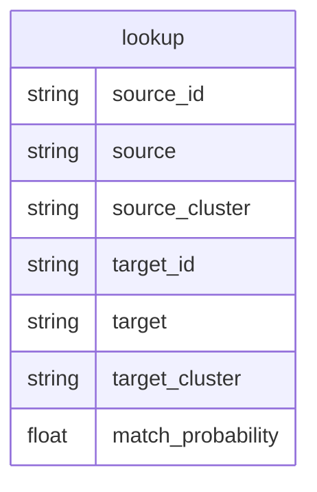

# 🔗 Company matching

A [Splink](https://moj-analytical-services.github.io/splink/) model for matching companies across DBT datasets.

See [Robin Linacre's series of articles on probabilistic record linkage](https://www.robinlinacre.com/probabilistic_linkage/) for theoretical underpinning (Fellegi and Sunter, 1969).

## Coverage

* [Companies House](https://data.trade.gov.uk/datasets/a777d199-53a4-4d0a-bbbb-1559a86f8c4c#companies-house-company-data)
* [Data Hub companies](https://data.trade.gov.uk/datasets/32918f3e-a727-42e6-8359-9efc61c93aa4#data-hub-companies-master)
* [Export Wins](https://data.trade.gov.uk/datasets/0738396f-d1fd-46f1-a53f-5d8641d032af#export-wins-master-datasets)
* [HMRC UK exporters](https://data.trade.gov.uk/datasets/76fb2db3-ab32-4af8-ae87-d41d36b31265#uk-exporters)

## Output

The current output is:



I think we can do better. In the below proposed output:

* String storage is minimised with key relationships
* Calculation is saved by only calculating on deduped records
* `data_workspace_tables` represents any and all tables joined by the model
* `unique_id_lookup` contains every key joined across all Data Workspace tables, even in things like HMRC Exporters, where we expect duplicate entries
* `unique_id_lookup` and `unique_id_reduped` translate between the duplicated work of Data Workspace and the deduplicated world of the Splink lookup

```mermaid
erDiagram
    lookup {
        uuid cluster
        int source FK
        int source_id FK
        int target FK
        int target_id FK
        float match_probability
    }
    table_alias_lookup {
        int id PK
        string table_name
    }
    unique_id_lookup {
        int id PK
        string unique_id PK_FK
    }
    unique_id_reduped {
        int source FK
        int dupe_id FK
        int id FK
    }
    data_workspace_tables{
        string id
        ... ...
    }
    
    table_alias_lookup ||--|{ lookup
    unique_id_lookup |o--|{ lookup
    table_alias_lookup |o--|{ unique_id_reduped
    unique_id_reduped ||--|| unique_id_lookup
    unique_id_reduped ||--|| unique_id_lookup
    unique_id_lookup  ||--|{ data_workspace_tables
```

## Release metrics

🛠 Coming soon!

## Usage

🛠 Coming soon!

## Contributing

Clone the repo, then run:

```bash
. setup.sh
```

This command:
* Deletes conda environment `company_matching` if it exists
* Creates a conda environment called `company_matching`
* Activates the `company_matching` environment
* Installs the project and its requirements into the `company_matching` environment

If you've spent time working on a different project and want to return to this one, you don't need to run `. setup.sh` again. To activate an existing environment:

```bash
conda activate company_matching
```

`. setup.sh` installs the project in editable mode. This means that any Python code can (and should) be imported as if the 'src' folder represented a Python library. E.g.:

```python
from src.data import utils as du
from src.locations import MODELS_HOME
```

In order to run notebooks correctly, you need to select the right environment as kernel. If you have just run `make requirements`, please refresh your browser window / editor to give a chance to the notebook engine to pick up the new kernel option.

### Managing Python dependencies

Every time a Python dependency needs to be added to this project, add it to `requirements.in` (in alphabetical order), and re-run `make requirements`. This will:

- Auto-generate or update the `requirements.txt` file which can then be committed
- Sync the active environment with the packages in `requirements.txt`.

The above is achieved under the hood by the `piptools` package. The `requirements.txt` file must not be changed manually. All of this also applies to `requirements-dev.in`. Failing to follow this process will lead to the divergence of local environments and their committed definition.

`piptools` allows versions for default dependencies to be fixed when `make requirements` is first run, using latest versions when possible. From that moment on, upgrading dependencies needs to be done manually by specifying version rules (e.g. `pandas>1.2.0`) in the `.in` requirement files.

The version of Python being used and some dependencies (e.g. `setuptools` and `piptools` itself) are not managed through `requirements.in` or `requirements.txt`. They are installed through conda, and fixed using a conda lock file. Please refer to the "Project organisation" section below to learn more.

### Using this repository

Documentation on how to use the code in this repository (e.g. how to train a model) should be placed in the `references` folder.

### Before a commit

Please format and lint the code before committing. If one of the checks fail, you will not be able to commit.

```bash
make precommit
```

## Project-specific commands
Project-specific commands (e.g. `make data` to generate a local extract from data workspace) are defined within the `Makefile`. To view all available commands, simply run:
```bash
make
```
To appear in this list, `make` steps should have a comment above them, as in all current examples. New `make` steps can depend on each other.


### Project Organisation

```
├── Makefile                        <- Makefile with commands like `make data` or `make train`
├── README.md                       <- The top-level README for developers using this project.
├── data
│   ├── external                    <- Data from third party sources.
│   ├── interim                     <- Intermediate data that has been transformed.
│   ├── processed                   <- The final, canonical data sets for modeling.
│   └── raw                         <- The original, immutable data dump.
│
├── models                          <- Local folder to keep serialised models for quick experiments
│                                       i.e. before they are sent to MLFlow
├── notebooks                       <- Jupyter notebooks. Naming convention is a number (for ordering),
│                                      the creator's surname, and a short `-` delimited description, e.g.
│                                      `1.0_smith_initial-data-exploration`.
│
├── references                      <- Data dictionaries, manuals, and all other explanatory materials
|   └── METHODOLOGY.md              <- Defines the model card and methodological decisions
│
├── outputs                         <- Generated analysis and results
│   └── figures                     <- Generated graphics and figures to be used in reporting
│
├── requirements.in                 <- The requirements file for reproducing the analysis environment
├── requirements-dev.in             <- The requirements file for working on this repo
│
├── setup.py                        <- makes project pip installable (pip install -e .) so src can
│                                      be imported
├── src                             <- Source code for use in this project.
│   ├── __init__.py                 <- Makes src a Python module
│   ├── locations.py                <- Includes constants for the path of various folders
│   │
│   ├── data                        <- Scripts to download or generate data
│   ├── features                    <- Scripts to turn raw data into features for modeling
│   ├── models                      <- Scripts to train models and make predictions
│   └── visualisation               <- Scripts to create exploratory and results oriented
│                                      visualisations
│
├── test                            <- Code defining tests for code under `/src`. Filenames need
|                                      to have a `test_` prefix to be run by the test runner
├── conda.lock.yml                  <- Defines precise conda environment to create.
│                                      It is created the first time `make environment` is run
│                                      To upgrade e.g. Python, edit Makefile, delete conda.lock.yml
│                                      and rerun
│
├── pre-commit-config.yaml          <- Configuration for pre-commit hooks
├── .env.sample                     <- Sample configuration variables and secrets for project
├── setup.cfg                       <- config file for flake8
├── setup.sh                        <- utility shell script that prepares repo for development (see │                                      "Getting started" above)
└── .gitlab                         <- folder containing merge template
```

### Environment variables

This repo contains a `.env.sample` file that should be renamed to `.env` and filled according to necessity. Then, the variables included can be referenced as follows:

```python
import os
from dotenv import load_dotenv, find_dotenv

# find .env automagically by walking up directories until it's found
dotenv_path = find_dotenv()
# load up the entries as environment variables
load_dotenv(dotenv_path)
```

You can use dotenv in IPython. By default, it will use find_dotenv to search for a .env file:

```
%load_ext dotenv
%dotenv
```

Please do not use environment variables for project paths. Instead, use `locations.py`.

--------

<p><small>Project based on the <a target="_blank" href="https://drivendata.github.io/cookiecutter-data-science/">cookiecutter data science project template</a>.</small></p>
