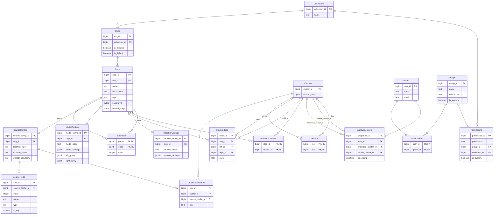

# PostgreSQL

A backend adapter for deploying Matchbox with PostgreSQL.

This backend stores two connected structures:

- An execution graph in `steps` and `step_from`, covering sources, models, and resolvers.
- A data graph in `clusters`, `contains`, `model_edges`, `resolver_clusters`, and `cluster_source_key`.

Source steps index source clusters. Model steps store score edges between clusters. Resolver steps point to the clusters that form a published entity view.

::: matchbox.server.postgresql
    options:
        show_root_heading: true
        show_root_full_path: true
        members_order: source
        show_if_no_docstring: true
        docstring_style: google
        show_signature_annotations: true
        separate_signature: true
        show_submodules: true
        extra:
            show_root_docstring: true
