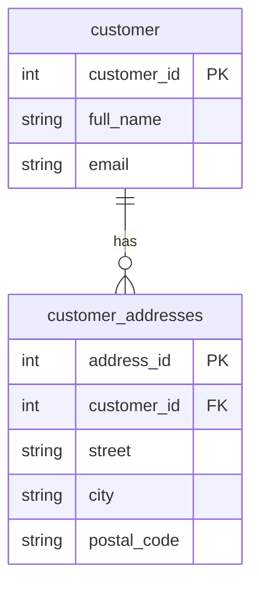
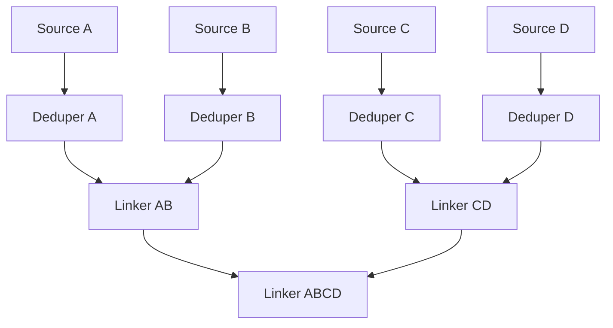
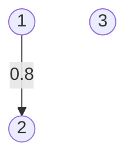
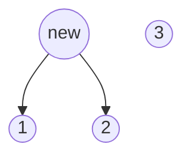

# Matchbox concepts

## Indexing data sources
Matchbox implements a database recording the outcome of processes that deduplicate and link data (activities which together are often called "entity resolution" or "data matching"). Before data can be deduplicated or linked, it needs to be indexed. Data in Matchbox is indexed by creating a **source**. Sources are data frames (i.e. data structures similar to SQL tables) with many rows, each corresponding to the items we want to deduplicate / link, and various columns, each representing the primary key / unique identifier for that data, or other data fields that will be used for matching.

Imagine having a data warehouse with two tables, `Customer`, and `CustomerAddresses`. Both tables refer to an identifier called `customer_id`.



To define a source we need to specify:

- Its **location**: in this case the type of data warehouse we're using as well as where to find it on the network
- The **extract / transform** logic that will create the source data frame. In this case it will be a SQL query
- The **key field**, which must be a primary key / identifier that is unique for each row of the source data frame
- The **indexed fields** which are other fields resulting from the extract / transform logic. We can only match on these fields.

For this example, we'll define the following extract / tramsform SQL query:

```sql
SELECT
    customer.customer_id,
    full_name,
    email,
    ARRAY_AGG(postal_code) AS postal_codes
FROM customer
LEFT JOIN customer_addresses
    ON customer.customer_id = customer_addresses.customer_id
GROUP BY customer.customer_id;
```

The key field will be `customer_id`, and the indexed fields will be `full_name`, `email`, `postal_code`. Imagine this the data we get back:

| customer_id | full_name        | email                   | postal_codes              |
|-------------|------------------|-------------------------|---------------------------|
| 1           | Alice Johnson    | alice@johnson.com       | {"90210", "10001"}        |
| 2           | Alice Johnson    | ajohnson@domain.com     | {"10001"}                 |
| 3           | Bob Smith        | bsmith@domain.com       | {"12345"}                 |


When we index a source, we never send the actual data to the Matchbox server. Instead, we create a unique string that represents each source row, which is called the **hash**. It's not possible to reconstitute the original row from the hash. It is possible to match the original source row, if you have it, to the hash. The fact that Matchbox never sees your data is a key part of its security. This feature is implemented using [hash functions](https://en.wikipedia.org/wiki/Hash_function), hence the name.


## Running models
After indexing your source, you will want to deduplicate it or link it to other data.

All deduplication and linking decisions in Matchbox are made by **models**. Models see a single input if they're **dedupers**, or two inputs (called "left" and "right") if they are **linkers**. In the simplest instance, model inputs can be sources. Models can also take other models as input. For example, a model can link the result of running of two dedupers, one on the left, and one on the right. In these way, models can be stacked on top of each other, e.g.:



Models output **results**, which is another data frame representing which rows each models suggests matching. A single row from the results data frame contains identifiers for two items the model wants to connect, and a floating point number between 0 and 1, representing how confidently the model thinks that the two items are the same.

Imagine wanting to deduplicate the source above. A deduper might suggest that the first two rows are the same with confidence 0.8. In this case it would output a single results row, corresponding to the link in the following graph of customer IDs:



The model is then written to the Matchbox server. We translate the results representation (i.e. pair-wise items + confidence level) into a clusters representation: we create a new object called a **cluster**, which is proposed by our deduper with confidence 0.8. Technically, we do this by finding the [connected components](https://en.wikipedia.org/wiki/Component_(graph_theory)) of the graph defined by the model results. The new cluster-based representation of what the deduper thinks with confidence 0.8 is as follows:



That is, it thinks that there are 2 entities in total describing customers:

* the one represented by the new cluster, which points to 2 distinct source items
* the one represented by the source item with `customer_id` equal to 3

In Matchbox, we also call "clusters" the indexed items from a source. To distinguish them from the clusters generated by model results, we talk of "source clusters" and "model clusters". Hence, we can reframe what we said previously about indexing:

> When a source is indexed, we create a new cluster for every item in the source. Each source cluster has a cluster hash which is the resulting of applying a hash function to the indexed fields for that item.

Model clusters have a hash too: they are generated by applying a hash function over the hash of all their children.

## Resolutions are queriable states
Objects that produce clusters are called points of resolution, or more simply, **resolutions**. A source resolution produces source clusters. A model resolution produces model clusters. A resolution defines a point of view about how to query data. From the point of view of the customer source resolutions, three entities exist: the three source clusters. Like in the example above, from the point of view of a model resolution, there are as many entities as model clusters it proposes, plus all unlinked source clusters. Every time some data is queried through Matchbox, it needs to use a resolution to decide:

* Which source items exist
* How to group together source items that belong to the same underlying entity


If you're not specifying a resolution explicitly, it means that a default resolution is being used, typically a top-level linker matching all the sources relevant to a domain.

Just like we can stack resolutions on top of each other, forming a **resolution graph**, their clusters will be stacked on top of each other to form a **cluster graph**.

To query from a resolution, we first determine the **resolution lineage**, that is the resolution being queried from and all its ancestors, i.e. its inputs, their inputs, and so on. Then, for each resolution in the lineage, we determine which clusters are reachable from that resolution. We know look to map all source clusters that are reachable to the highest-level model clusters (if any) that are also reachable from the lineage.


## Architecture

Sources are materialised (i.e. their corresponding dataframe is computed) client-side. Similarly, the source cluster hashes are computed on the client-side. This guarantees no real data other than primary keys is ever sent to the Matchbox backend. Models are also run client-side, but model cluster hashes are computed on the server-side, to minimise the transfer of data between client and server.

On the backend, these Matchbox concepts are implemented by adapters, mapping high-level operations such as indexing a source or querying from a resolution to lower-level constructs, operating on data stores and databases. For example, we have implemented an adapter using PostgreSQL to capture resolutions and clusters, and an S3 bucket as an interim location to store sources and results coming from clients before they're written to the database. The lower-level implementation of these high-level concepts can sometimes get a bit complicated to ensure storage space is used effectively and operations are

Each adapter inherits from a base adapter class, which means that as long as all its abstract methods are implemented correctly, each adapter is functionally interchangeable, though of course will have different properties in terms of e.g. cost and efficiency. Most backend tests are also adapter-agnostic, and can easily be extended to cover new adapters.

