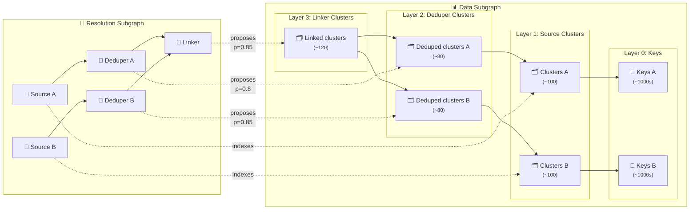
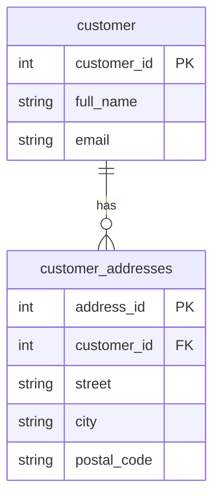
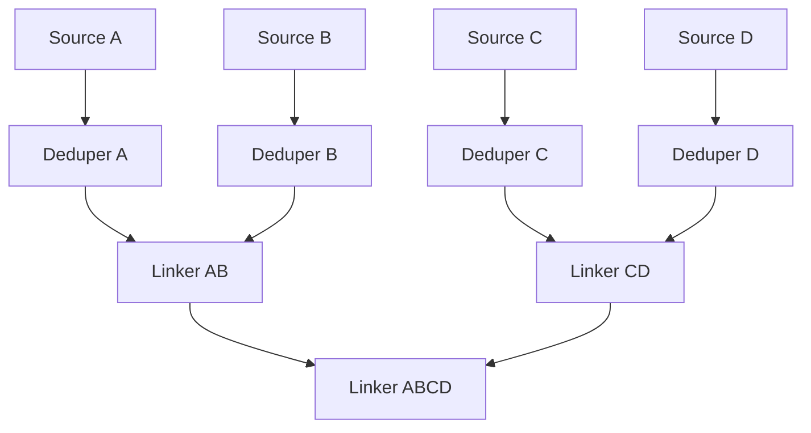
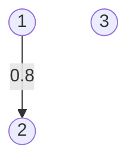
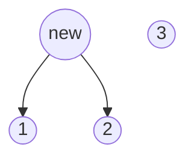

# Matchbox concepts

🔥 Matchbox is a pipeline orchestration tool for record matching. It provides a unified way to run matching workflows and store their results, enabling collaboration between services, analysts, data labelers, and product owners — all in one place.

All Matchbox databases represents a graph with two parallel subgraphs:

* At a high level, Matchbox stores interleaving directed acyclic graphs (DAGs) of "resolutions". These represent "sources" of data, and "models" that propose deduplication or linking of that data. These DAGs have relatively few nodes.
* At a lower level, and in parallel, Matchbox stores the interleaving DAGs of the clusters formed by these resolutions. These are the "keys", or the real references to data in your warehouse, and the "clusters", which are created as resolutions propose merges of existing keys or other clusters. These DAGs will be very large, comprising many nodes structured as a hierarchy with multiple levels.

As you can see in the example diagram below, these worlds are bridged by edges, labelled "proposes" or "indexes", depending on the type of resolution.

Source resolutions can index the same cluster. Model resolutions can agree on a cluster, but disagree on how sure they are it's correct.



In this guide, we'll attempt to explain each of these concepts one by one.

## Sources
Suppose you want to deduplicate or link entities — like customers in a CRM. You likely have multiple datasets describing different aspects of each customer. A source in Matchbox is a curated view that joins and optionally aggregates these datasets, so each row represents a single entity instance.

All datasets assembled into a source should have a unique key that describes the entity you want to link, such as a consistent and well-defined `customer_id`.

Before data can be deduplicated or linked, it needs to be turned into a source and indexed. Matchbox represents sources as data frames (i.e., data structures similar to SQL tables) with many rows, each corresponding to the items we want to deduplicate or link, and various columns, each representing the primary key or unique identifier for that data, or other data fields that will be used for matching.

Imagine having a data warehouse with two tables, `Customer`, and `CustomerAddresses`. Both tables refer to an identifier called `customer_id`.



To define a source we need to specify:

- Its location: in this case, the type of data warehouse we're using as well as where to find it on the network
- The extract/transform logic that will create the source data frame. In this case, it will be a SQL query
- The key field, which must be a primary key or identifier that is unique for each row of the source data frame
- The indexed fields: other fields resulting from the extract/transform logic. We can only match on these fields.

For this example, we'll define the following extract/transform SQL query:

```sql
SELECT
    customer.customer_id,
    full_name,
    email,
    ARRAY_AGG(postal_code) AS postal_codes
FROM customer
LEFT JOIN customer_addresses
    ON customer.customer_id = customer_addresses.customer_id
GROUP BY customer.customer_id;
```

The key field will be `customer_id`, and the indexed fields will be `full_name`, `email`, `postal_code`. Imagine this is the data we get back:

| customer_id | full_name        | email                   | postal_codes              |
|-------------|------------------|-------------------------|---------------------------|
| 1           | Alice Johnson    | alice@johnson.com       | {"90210", "10001"}        |
| 2           | Alice Johnson    | ajohnson@domain.com     | {"10001"}                 |
| 3           | Bob Smith        | bsmith@domain.com       | {"12345"}                 |
| 4           | Bob Smith        | bsmith@domain.com       | {"12345"}                 |

Note that the third and fourth rows, excluding the key, are identical. No model could differentiate between them based on the fields returned by the source. For this reason, we index them as one item but record that our indexed item maps to two distinct source keys.

Matchbox prioritizes data privacy. When indexing a source, it never transmits raw data to the server. Instead, it generates a representation called the "hash" — a unique, irreversible string derived from the data fields. This ensures:

* The original data cannot be reconstructed from the hash
* The same data always produces the same hash, enabling matching

This feature is implemented using [hash functions](https://en.wikipedia.org/wiki/Hash_function), hence the name.


## Models and clusters
After indexing your source, you will want to deduplicate it or link it to other data.

All deduplication and linking decisions in Matchbox are made by models. Models see a single input if they're dedupers, or two inputs (called "left" and "right") if they are linkers. In the simplest instance, model inputs can be sources. Models can also take other models as input. For example, a model can link the result of running two dedupers, one on the left, and one on the right. In this way, models can be stacked on top of each other, e.g.:



Models output "results", which is another data frame representing which rows a model suggests matching. A single row from the results data frame contains identifiers for two items the model wants to connect, and a floating point number between 0 and 1, representing how confidently the model thinks that the two items are the same. We call this confidence score a "probability", even though it isn't a probability in a strictly mathematical sense. The simplest models are deterministic and will only output rows with a probability equal to 1.

Imagine wanting to deduplicate the source above. A deduper might suggest that the first two rows are the same with a confidence level of 0.8. In this case, it would output a single results row, corresponding to the link in the following graph of customer IDs:



The model is then written to the Matchbox server. We translate the results representation (i.e. pair-wise items plus confidence level) into a cluster representation: we create a new object called a cluster, which is proposed by our deduper with confidence 0.8. Technically, we do this by finding the [connected components](https://en.wikipedia.org/wiki/Component_(graph_theory)) of the graph defined by the model results. The new cluster-based representation of what the deduper thinks with confidence 0.8 is as follows:



That is, it thinks that there are two entities in total describing customers:

* the one represented by the new cluster, which points to two distinct source items
* the one represented by the source item with `customer_id` equal to 3

In Matchbox, we also call "clusters" the indexed items from a source. To distinguish them from the clusters generated by model results, we talk of "source clusters" and "model clusters". Hence, we can reframe what we said previously about indexing:

> When a source is indexed, we create a new cluster for every unique item in the source. Multiple rows from the source data frame could map to a single cluster if they are identical except for their keys. Each source cluster has a cluster hash which is the result of applying a hash function to the indexed fields for that item.

Model clusters have a hash too: they are generated by applying a hash function over the hash of all their children.

## Resolutions
Objects that produce clusters are called points of resolution, or more simply, resolutions. A resolution defines a point of view about how to query data:

* A source resolution produces source clusters. From the point of view of the customer source resolutions, three entities exist: the three source clusters.
* A model resolution produces model clusters. Like in the example above, from the point of view of a model resolution, there are as many entities as model clusters it proposes, plus all unlinked source clusters.

Every time some data is queried through Matchbox, it needs to use a resolution to decide:

* Which source items exist
* How to merge source items that belong to the same underlying entity

If you don't specify a resolution explicitly, it means that a default resolution is being used, typically a top-level linker that matches all sources relevant to a domain.

Just as we can stack resolutions on top of each other, forming the resolution subgraph, their clusters and source keys will be stacked on top of each other to form the data subgraph. As noted above, the two subgraphs are connected by edges:

* "indexes" edges connect source resolutions to source clusters
* "proposes" edges (with their probability) connect model resolutions to model clusters.

To query from a resolution, we first determine the "resolution lineage". The resolution lineage includes the resolution used to query and all its ancestors, i.e. its inputs, their inputs, and so on. Then, for each resolution in the lineage, we determine which clusters are reachable from that resolution. We now look to map all reachable source clusters to the highest-level model clusters (if any) that are also reachable from the lineage.


## Architecture

Sources are materialised (i.e. their corresponding data frame is computed) client-side. Similarly, the source cluster hashes are computed on the client side. This guarantees that no real data other than primary keys is ever sent to the Matchbox backend. Models are also run client-side, but model cluster hashes are computed on the server-side to minimise the transfer of data between client and server.

On the backend, these Matchbox concepts are implemented by adapters, which map high-level operations such as indexing a source or querying from a resolution to lower-level constructs, that operate on data stores and databases. For example, we have implemented an adapter using PostgreSQL to capture resolutions and clusters, and an S3 bucket as an interim location to store sources and results coming from clients before they're written to the database. The lower-level implementation of these high-level concepts can sometimes get a bit complicated to ensure storage space is used effectively and operations are fast.

Each adapter inherits from a base adapter class, which means that as long as all its abstract methods are implemented correctly, each adapter is functionally interchangeable, though of course each will have different properties in terms of cost and efficiency. Most backend tests are also adapter-agnostic, and can easily be extended to cover new adapters.

