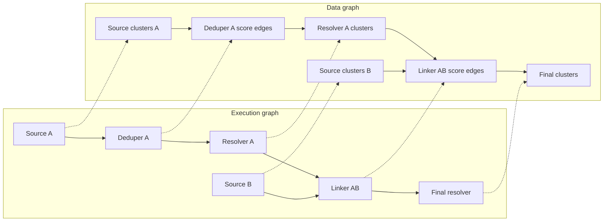
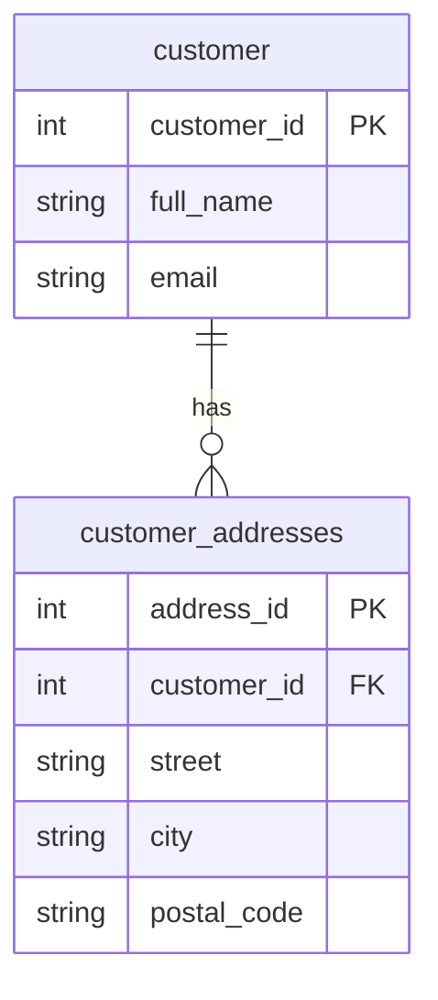
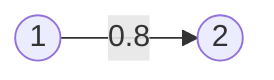
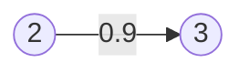
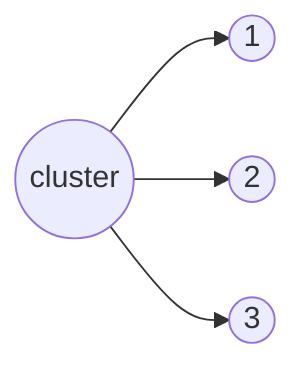

# Matchbox concepts

Matchbox orchestrates entity resolution pipelines and stores their outputs in a shared backend. It gives data engineers, analysts, reviewers, and downstream services a common view of sources, matching logic, and resolved entities.

A Matchbox backend stores two connected structures:

- An execution graph containing sources, models, and resolvers.
- A data graph containing source clusters, model score edges, and resolver clusters.

The execution graph is the small DAG you build and publish. The data graph follows the same topology, but stores the source clusters, score edges, and resolver clusters created by those steps.


```mermaid
graph LR
    subgraph EG["Execution graph"]
        direction TD
        SA["Source A"] --> MA["Deduper A"]
        MA --> RA["Resolver A"]
        RA --> LAB["Linker AB"]
        SB["Source B"] --> LAB
        LAB --> RF["Final resolver"]
    end

    subgraph DG["Data graph"]
        direction TD
        SAC["Source clusters A"] --> MAS["Deduper A score edges"]
        MAS --> RAC["Resolver A clusters"]
        RAC --> LABS["Linker AB score edges"]
        SBC["Source clusters B"] --> LABS
        LABS --> RFC["Final clusters"]
    end

    SA -.-> SAC
    MA -.-> MAS
    RA -.-> RAC
    SB -.-> SBC
    LAB -.-> LABS
    RF -.-> RFC
```

## Sources

A source is a curated view of the records you want to match. It usually comes from a warehouse query, file extract, or other structured data feed.

Every source needs:

- A location that tells Matchbox where the data lives.
- An extract-transform definition that produces the source rows.
- A key field that uniquely identifies each row.
- Index fields that Matchbox is allowed to use for matching.

Imagine a warehouse with `customer` and `customer_addresses` tables linked by `customer_id`.


```mermaid
erDiagram
    customer ||--o{ customer_addresses : has
    customer {
        int customer_id PK
        string full_name
        string email
    }
    customer_addresses {
        int address_id PK
        int customer_id FK
        string street
        string city
        string postal_code
    }
```

One source might use this SQL:

```sql
SELECT
    customer.customer_id,
    full_name,
    email,
    ARRAY_AGG(postal_code) AS postal_codes
FROM customer
LEFT JOIN customer_addresses
    ON customer.customer_id = customer_addresses.customer_id
GROUP BY customer.customer_id;
```

The source key is `customer_id`. The index fields are `full_name`, `email`, and `postal_codes`.

| customer_id | full_name        | email                   | postal_codes              |
|-------------|------------------|-------------------------|---------------------------|
| 1           | Alice Johnson    | alice@johnson.com       | {"90210", "10001"}        |
| 2           | Alice Johnson    | ajohnson@domain.com     | {"10001"}                 |
| 3           | Bob Smith        | bsmith@domain.com       | {"12345"}                 |
| 4           | Bob Smith        | bsmith@domain.com       | {"12345"}                 |

Note that the third and fourth rows, excluding the key, are identical. No model could differentiate between them based on the fields returned by the source. For this reason, we index them as one item but record that our indexed item maps to two distinct source keys.

Matchbox never sends raw source fields to the backend. It hashes the indexed values client-side and uploads those hashes instead, so the server stores stable identifiers for matching without storing the source data itself.

## Models and scores

Models perform the matching work.

- A deduper consumes one query.
- A linker consumes a left query and a right query.
- A model can consume sources directly or query through upstream resolvers.

The output of a model is a table of scored pairs. Each row contains:

- `left_id`
- `right_id`
- `score`

The score is a floating-point value between `0.0` and `1.0`. Deterministic models usually emit `1.0`. Learned or weighted models can emit any value in that range.

Matchbox uses the word `score` rather than `probability` because these values
act as match-strength signals without claiming a formal probabilistic
interpretation.

For example, if a deduper thinks customer `1` and customer `2` refer to the same entity with score `0.8`, the model output looks like this:


```mermaid
graph LR
    1((1))
    2((2))
    1 -- 0.8 --> 2
```

Model steps store those scored edges on the backend. They do not define the final entity view on their own.

## Resolvers and clusters

Resolvers turn model score edges into clusters. A resolver can consume one model or several models, which makes clustering policy explicit and reusable.

One common strategy is connected components over all model edges that meet per-model thresholds. Imagine a second model produced the following model output:


```mermaid
graph LR
    2((2)) -- 0.9 --> 3((3))
```

Concatenating that with the first model's edges gives:

| left | right | score |
|------|-------|-------|
| 1 | 2 | 0.8 |
| 2 | 3 | 0.9 |

Connected components over that combined edge set produces one cluster containing all three customers:


```mermaid
graph LR
    0((cluster))
    1((1))
    2((2))
    3((3))
    0 --> 1
    0 --> 2
    0 --> 3
```

Matchbox uses three important ideas here:

- Source steps create source clusters.
- Model steps create score edges between existing clusters.
- Resolver steps create the clusters that users query.

When you query Matchbox, you always query through a resolver. The default resolver is the single final resolver for a published DAG.

## Architecture

Sources, models, and resolvers run client-side.

- Sources materialise data and hashes locally.
- Models compute score edges locally.
- Resolvers compute cluster assignments locally.

The backend stores fingerprints, step metadata, model scores, resolver clusters, and evaluation data. This keeps the server focused on coordination, storage, and querying rather than warehouse-side matching logic.

The PostgreSQL adapter is one implementation of that backend contract. Other adapters can implement the same interfaces as long as they preserve the same high-level behaviour.
