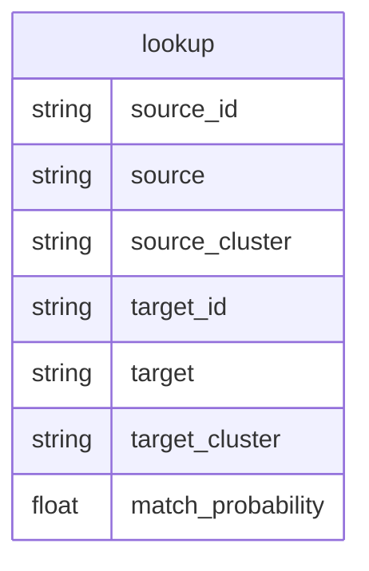

# Development notes

A rough document to collect dev ideas that aren't right for README.

See [🔗Company matching v2.1 architecture ideas](https://uktrade.atlassian.net/wiki/spaces/DT/pages/3589275785/Company+matching+v2.1+architecture+ideas) for the architecture we're implementing here, codename 🔌hybrid additive.

## Structure notes

* `src/data/` contains classes for read/writing from our key tables
    * STAR (dim/fact lookup)
    * Source (dim/fact combos)
    * Probabilities (probability table)
    * Clusters (cluster table)
    * Validation (user validation table)
* `src/link/` contains an abstract Linker class and individual linker method subclasses
* `src/pipeline/` will contain matches that link the cluster table on the left with a dim table on the right, one script per link
* `src/config.py` configures the whole thing
* Not sure where entrypoint for a run is quite yet

## Process notes and ideas

* Some kind of `make setup` that sets up the system ready to link. Includes:
    * `make star`, which writes/updates a `star` table where each row is the name of a fact table and dimension table, plus a pk
    * `make dims`, which writes/updates the dim tables that are controlled by the framework
* `make links`, which uses `src/config.py` to run the whole pipeline step by step. Includes:
    * Instantiating the initial `clusters` table
    * Instantiate the `probabilities` table
    * For each link in the chain
        * Link cluster with table on right
        * Update `probabilities` with output
        * Update `clusters` with processed `probabilities`
        * Log performance vs `validate`
* A function to turn `clusters` into a `lookup` for the end user
* A streamlit app to validate connections found in either `clusters` or `probabilities`
    * A `validate` table that records user decisions
    * A reporting page that shows various model performance against this
        
## Linker notes

What does ANY linker neeed?

* The left data: cluster data, pivoted wide, with fields to join
    * Call cluster data method from Clusters
* The right data: dim table data
    * Call dim retrieval method from Source
* A prepare method. An optional bit for subclasses to fill in
    * Should require dict parameterisation
    * Preprocessing handled here, even if called from new methods
    * Linker training handled here, even if called from new methods
* A link method to output data. A bit subclasses MUST fill in
    * Optional experiment parameter
    * Ouput as df or direct to probabilities table?
        * Add experiment to Probabilities table so we can compare outputs
* An evaluate method
    * With option to use MLFlow
    * With option to output to Probabilities table
    * Against a single experiment ID (MLflow or otherwise)
        * Runs prepare
        * Runs link
        * Runs a standard report

What does ONE linker need?

* The above, but
    * link method must contain more code
    * prepare method might contain more code

## Output

### v0.1

The current output is:



### v0.2

I think we can do better. The proposed output below is a small relational database optimised for three separate use cases: **linking**, **deduping** and **verifying**.

[Notes on this on Confluence.](https://uktrade.atlassian.net/wiki/spaces/DT/pages/3573448705/Company+matching%3A+operationalisation)


* String storage is minimised with key relationships
* We use our knowledge of how fact tables relate to form a DAG of matching, where we only match between pairs of tables with an edge
* Calculation is saved by only matching on naïve-deduped records, which form dimension tables for each fact table of interest
    * Naïve deduping considers a combination of fields to be "unique" without any alteration. To improve naïve deduping, we need a ⚙️process that uses the below deduping outputs
    
I got carried away with the SQL translation from `lookup` and `verify` to `clusters`. Sorry. To explain it in English:

* The lookup table contains all pairwise predictions over a certaion %ge probability
* We join in `verify` when the `verified` bool agrees over a certain %ge, and allocate a probability match of 1
* We order these matches by %ge probability descending
* We take the highest probability match for each distinct pair of source id and target table and add it to `clusters`
    * This is achieved by recursing on an anti-join with `clusters` until lookup is empty
    * If a source id and target table is in `clusters`, it can't be inserted again
    * Recall a verified match is probability 1, always, so goes to the top
* This isn't in the SQL, but if all matches in the cluster are verified, `verified` is set to true in `clusters`
    
#### Linking

To **link** in production, we use something like this to return the relevant columns from the various fact tables, with lots of nulls:

```
select
    cl.uuid,
    f1.field_of_interest,
    f1.field_of_interest,
    f2.field_of_interest
from
    clusters cl
-- for each fact table we want to get data from
where
    source in (fact_table_1, fact_table_2, ...)
left join
    dim_table_1 d1 on
    cl.source_id = d1.unique_id
left join
    fact_table_1 f1 on
    -- repeat for all fields except unique_id
    d1.unique_field_* = f1.unique_field_*
```

It's up to the user and use case as what to do next.

* To summarise something like HMRC exporters, add `group by cl.uuid` and use `max()` for fields you're certain have a single value (like the name in Data Hub), and `avg()`, `sum()`, `count()` or whatever to get your summary stats
* To get unique values on a single row, add `group by cl.uuid` and use `max()` to drop all the nulls

Ideally we'd fold this into a `company_join()` PostgreSQL function to hide the mess.

#### Deduping

To **dedupe** in production, we use something like this to show a list of pairs of potential duplicates in a single table:

```
select
    lk.source_id,
    lk.match_probability,
    fl.field_of_interest,
    fr.field_of_interest,
from
    lookup lk
where
    source = target
    and source = 'fact_table'
left join
    dim_table dl on
    lk.source_id = dl.unique_id
left join
    fact_table fl on
    -- repeat for all fields except unique_id
    dl.unique_field_* = fl.unique_field_*
left join
    dim_table dr on
    lk.source_id = dr.unique_id
left join
    fact_table fr on
    -- repeat for all fields except unique_id
    dr.unique_field_* = fr.unique_field_*
```

Ideally we'd fold this into a `company_dedupe()` PostgreSQL function to hide the mess.

#### Verifying

To **verify** in producion, we provide a bool in the `clusters` table, and a `verify` table. These tables will enable us to iterate company matching against a "ground truth".

A ⚙️process would be needed to examine matches and allow users to write true/false to the `verify` table.

The `clusters` `verified` column is either all true, or all false, and is only set when all pairs agree.