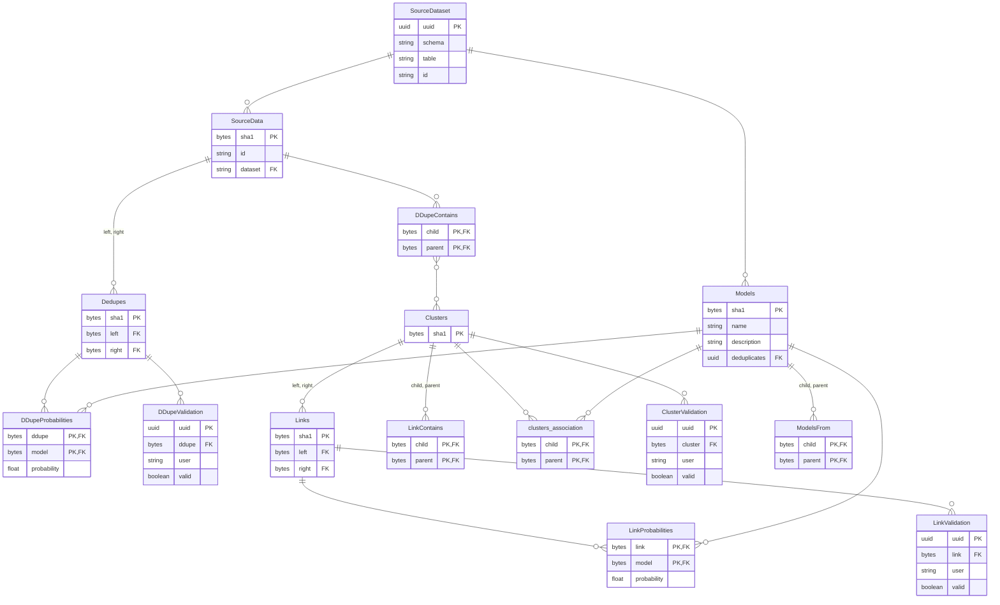
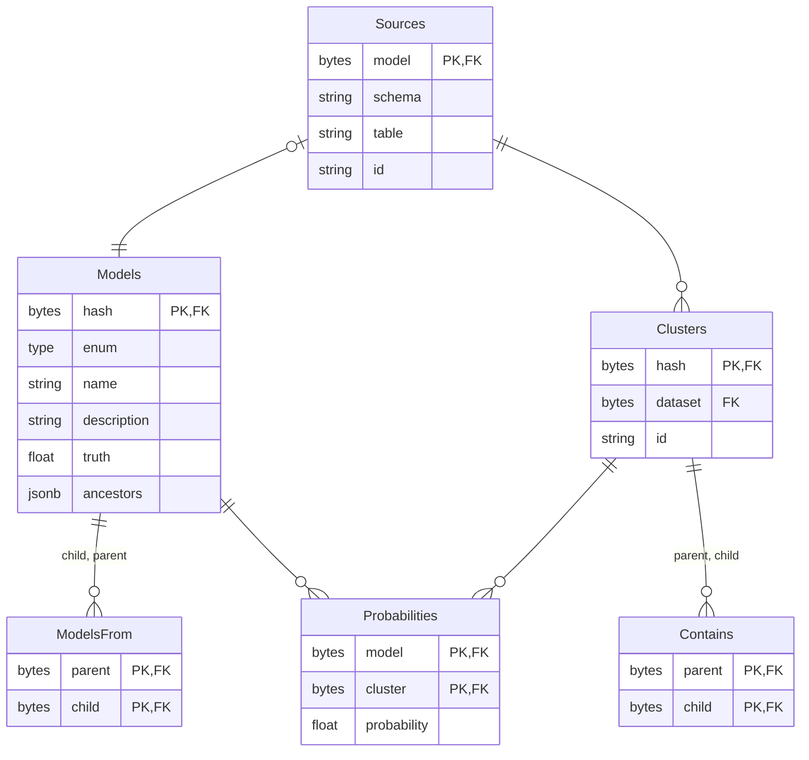

# 🔥 Matchbox PostgreSQL backend

A backend adapter for deploying Matchbox using PostgreSQL.

Currently implements the following architecture.

## 🔥 Matchbox 0.2

I think this could be expressed more simply. See Confluence for [further discussion of this proposal](https://uktrade.atlassian.net/wiki/spaces/CDL/pages/4282908700/Matchbox+0.2+architecture+ideas).

Here we register every new dataset in the models table.

`Models.type` is one of "model", "dataset" or "human". This slight entity drift in the models table allows other tables to remain pure.

We employ the following check constraints in Models:

* When type is "model", hash MUST NOT appear in Sources and MUST appear in ModelsFrom
* When type is "dataset", hash MUST appear in Sources and MUST appear in ModelsFrom
* When type is "human", hash MUST NOT appear in Sources and MUST NOT appear in ModelsFrom

