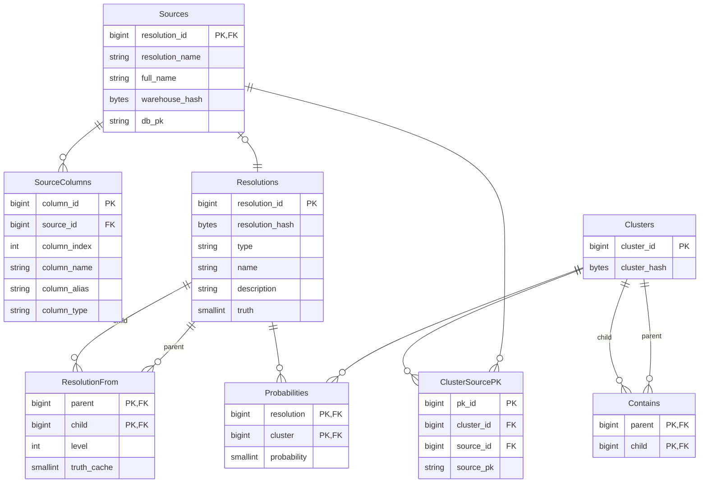

# 🔥 Matchbox PostgreSQL backend

A backend adapter for deploying Matchbox using PostgreSQL.

Currently implements the following architecture. See Confluence for [further details](https://uktrade.atlassian.net/wiki/spaces/CDL/pages/4282908700/Matchbox+0.2+architecture+ideas).

`Resolutions.type` is one of "model", "dataset" or "human".

There are two graph-like trees in place here.

* In the resolution subgraph the tree is implemented as closure table, enabling quick querying of root to leaf paths at the cost of redundancy
* In the data subgraph the tree is implemented as a hierarchy, which means recursive queries are required to resolve it, but less data is stored

